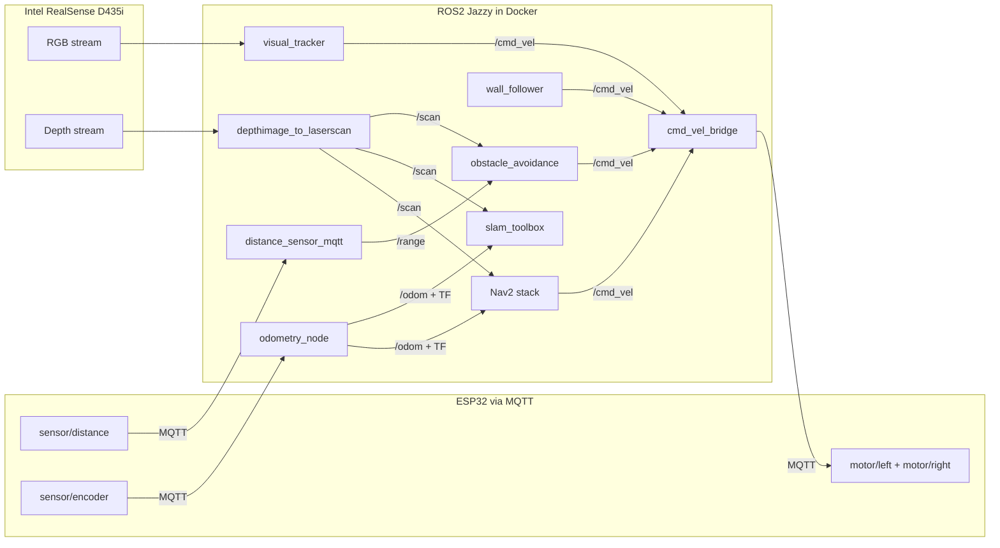

# Szuflada V2 Autonomous System Plan

## Architecture Overview




## Important Constraints

- **Encoders are direction-blind**: The ESP32 encoders only count up (RISING edge). The odometry node must track direction based on the last motor command.
- **ESP32 encoder format**: `"enc1_total,enc2_total,enc1_delta,enc2_delta"` every 200ms
- **Motor inversion**: Forward = negative PWM values (per current calibration in `rover_teleop.py`)
- **Physical measurements needed**: Wheel diameter and wheel base distance -- will use placeholders (65mm wheel, 200mm base) configurable as ROS2 parameters.

## Phase 1: cmd_vel Bridge + Odometry (foundation)

The most critical piece. Everything autonomous (obstacle avoidance, Nav2, visual tracking) outputs `geometry_msgs/Twist` on `/cmd_vel`. We need a node that converts that to MQTT motor commands. We also need odometry from encoder data.

### New files to create in `rover_autonomy/rover_autonomy/`:

- `**cmd_vel_bridge.py**` -- Subscribes to `/cmd_vel` (Twist), converts `linear.x` + `angular.z` to differential drive left/right PWM values, publishes via MQTT to `motor/left` and `motor/right`. This replaces the direct MQTT calls in teleop and lets ANY ROS2 node drive the rover.
- `**odometry_node.py**` -- Subscribes to `sensor/encoder` via MQTT, tracks motor direction from `/cmd_vel`, computes wheel odometry using differential drive kinematics, publishes `nav_msgs/Odometry` on `/odom` and broadcasts `odom -> base_link` TF transform.
- `**robot_description.py**` -- Publishes a simple URDF describing the rover frame: `base_link`, `ultrasonic_link`, `camera_link`. Broadcasts static TF transforms.

### Key parameters (configurable, calibrate later):

- `wheel_diameter`: 0.065 m (placeholder)
- `wheel_base`: 0.20 m (placeholder)
- `encoder_ticks_per_rev`: 20 (placeholder -- depends on encoder disk)
- `max_pwm`: 255
- `max_linear_speed`: 0.3 m/s (placeholder)

## Phase 2: RealSense Depth as Virtual LaserScan

No custom code needed -- use existing ROS2 packages:

- `**realsense2_camera**` -- RealSense ROS2 driver (publishes RGB + depth topics)
- `**depthimage_to_laserscan**` -- Converts depth image to `sensor_msgs/LaserScan` on `/scan`

This gives us a virtual 2D lidar from the D435i depth camera, usable by obstacle avoidance, SLAM, and Nav2.

### Install inside Docker:

```
apt install ros-jazzy-realsense2-camera ros-jazzy-depthimage-to-laserscan
```

## Phase 3: Obstacle Avoidance

- `**obstacle_avoidance.py**` -- Subscribes to `/scan` (virtual laser from depth camera) and `/range` (ultrasonic from ESP32). Publishes `/cmd_vel`. Logic: drive forward, if obstacle within threshold, stop and turn in the clearest direction.

## Phase 4: Wall Following

- `**wall_follower.py**` -- Subscribes to `/scan`. Maintains a set distance from the nearest wall using a PID controller. Publishes `/cmd_vel`.

## Phase 5: SLAM Mapping (slam_toolbox)

No custom code -- use `slam_toolbox` package with our `/scan` + `/odom`:

```
apt install ros-jazzy-slam-toolbox
```

Requires a config YAML file for slam_toolbox parameters. Drive the rover (teleop or obstacle avoidance) to build a map. Save the map with:

```
ros2 run nav2_map_server map_saver_cli -f ~/map
```

## Phase 6: Nav2 Autonomous Navigation

Full navigation stack with path planning and obstacle avoidance:

```
apt install ros-jazzy-navigation2 ros-jazzy-nav2-bringup
```

Requires:

- A saved map from Phase 5
- Nav2 parameter YAML configured for Szuflada's dimensions
- A launch file that starts Nav2 with the correct config

Set goals via RViz2 or programmatically.

## Phase 7: Visual Tracking

- `**visual_tracker.py**` -- Subscribes to RealSense RGB topic. Uses OpenCV to detect and track a target (color blob or object). Converts target position in frame to `/cmd_vel` commands (turn toward target, drive forward).

## Files Summary

All new files go in `rover_autonomy/rover_autonomy/`:


| File                    | Phase | Purpose                      |
| ----------------------- | ----- | ---------------------------- |
| `cmd_vel_bridge.py`     | 1     | Twist -> MQTT motor commands |
| `odometry_node.py`      | 1     | Encoder MQTT -> /odom + TF   |
| `robot_description.py`  | 1     | URDF + static TF             |
| `obstacle_avoidance.py` | 3     | Reactive obstacle avoidance  |
| `wall_follower.py`      | 4     | PID wall following           |
| `visual_tracker.py`     | 7     | OpenCV color/object tracking |


Plus config/launch files:


| File                        | Phase | Purpose                                        |
| --------------------------- | ----- | ---------------------------------------------- |
| `launch/autonomy_launch.py` | 1     | Launches bridge + odom + RealSense + depthscan |
| `config/nav2_params.yaml`   | 6     | Nav2 configuration for Szuflada                |
| `config/slam_params.yaml`   | 5     | slam_toolbox configuration                     |


`setup.py` updated with all new entry points.

## Recommended Build Order

Start with Phase 1 (cmd_vel bridge + odometry) since everything else depends on it. Then Phase 2 (RealSense setup) and Phase 3 (obstacle avoidance) give you a rover that drives around without hitting things. The rest builds on top incrementally.